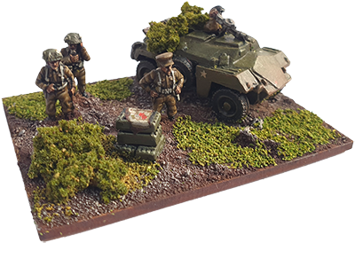

# A Quick Reference App for Reisswitz Press' *'O' Group*

[See the project in action here.](https://ogroup.nomorelostsheets.com)

The project runs as a static React app on AWS. It asks the user to select some units before they begin, then shows simplified quick reference tables based on just those units.

Exploring this space trying to make sense of it - leafing through multiple paper quick references is a big barrier to entry for complex games. Can web apps make that simpler?
